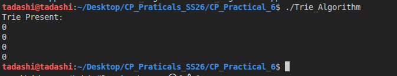
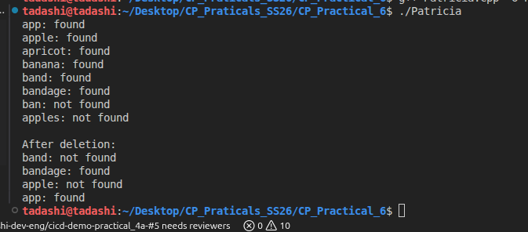
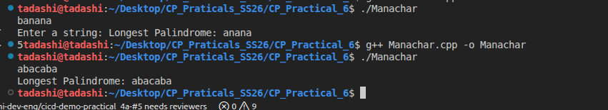

# Trie Algorithm
- It is a tree like data structure where each node represents a character of a string.
- The root node represent an empty string and each edge represents a character.
- Each path of the tree represents a word.
- Each node will have 26 pointer to represent the letter from a-z
- A boolen flag is used to make the end of a word in the path of a trie.

### Reflection
The `TrieNode` class contains 26 child pointers and a boolean `endofWord` flag for marking completed words. The `Trie` class maintains a root node and provides `insert`, `search`, and `remove` methods. Insertion and search both traverse the trie from the root, following child pointers that correspond to each lowercase letter in the word. Removal only clears the `endofWord` flag at the final node, which logically deletes the word while preserving shared prefixes for other words.

This design is simple and effective for small dictionaries, but the removal method does not reclaim memory for deleted branches. That means nodes remain allocated even after words are removed, which is acceptable here because the algorithm is intended to show trie behavior rather than handle memory-heavy workloads.

### How the algorithm works with the sample inputs

The `main()` function in the code has lowercase words that insert: `tashi`, `penjor`, and `sonam`.

- `trie.insert("tashi")` creates a path from the root for `t -> a -> s -> h -> i` and marks the final node.
- `trie.insert("penjor")` creates a path for `p -> e -> n -> j -> o -> r` and marks the final node.
- `trie.insert("sonam")` creates a path for `s -> o -> n -> a -> m` and marks the final node.

Each `search()` call walks the same character path and returns `true` only if the final node exists and `endofWord` is set.

- `trie.search("tshewang")` returns `false` because the path does not exist from the root.
- `trie.search("pema")` returns `false` because the path for `p -> e -> m` is missing; only `p -> e -> n` exists.
- `trie.search("seldon")` returns `false` because the path does not match any inserted word.

After `trie.remove("penjor")`, the node path for `penjor` stays in memory, but the final node is unmarked. A subsequent search for any unrelated word like `something` still searches the trie and returns `false` because the word path is absent. If the removed word itself were searched, `trie.search("penjor")` would return `false` even though the nodes remain present.

The output of the code shows that the search function was not able to match the inserted word which is indicated by boolen 0 ( false ). In the best case if I search for the same word I inserted it will print the boolen 1 ( true).

### Time Complexity

- `insert(word)`: O(L), where L is the length of the word. Each character is processed once.
- `search(word)`: O(L), where L is the length of the word.
- `remove(word)`: O(L), where L is the length of the word. The implementation only unmarks the end-of-word flag and does not free nodes.

### Space Complexity

- Worst-case space: `O(N * L * 26)` for the trie structure, where N is the number of words and L is the average word length. Each node allocates an array of 26 pointers.

# Patricia's Algorithm

The Patricia trie implementation compresses shared prefixes into labeled edges, so fewer nodes are required than a standard trie. Insert and search operations match as much of the remaining key as possible against edge labels, and deletion clears the end-of-word marker while pruning nodes that are no longer needed. This makes the Patricia trie more memory-efficient for many strings, but it also requires extra logic for splitting and merging edges when keys diverge or are removed. The current implementation demonstrates the tradeoff between compact storage and the more complex update rules needed for compressed tries.

The algorithm has 6 words inserted in and and the search functions return the boolen 1 meaning found. But in the worst case after deletion of band and apple the search function for bandage and app is untouched. 

### Time Complexity

- `insert(key)`: O(L) on average, where L is the length of the key. Each character is consumed once while matching or splitting edge labels.
- `search(key)`: O(L) on average, since the algorithm walks edge labels and subtracts matched prefixes until the key is consumed.
- `remove(key)`: O(L) on average, plus a small cleanup cost for collapsing nodes and merging edge labels when branches become redundant.

### Space Complexity

- Space is proportional to the total number of characters stored in edge labels and the number of nodes needed after compression. In the best case, shared prefixes are stored only once, giving much lower overhead than a standard trie.
- In the worst case, with no common prefixes, the space cost is still O(N * L), where N is the number of keys and L is the average key length.

# Manachar's Algorithm

The Manacher implementation computes the longest palindromic substring in linear time by expanding palindromes around each center while reusing previously computed palindrome radii. It maintains two arrays:

- `d1` for odd-length palindromes centered at each character.
- `d2` for even-length palindromes centered between characters.

For each position, the algorithm uses the current rightmost palindrome window `[l, r]` and the mirror of the current center to initialize a radius. It then expands only as needed, avoiding repeated work and keeping the runtime `O(n)`.

### Reflection

This implementation is efficient and well-suited for the longest-palindromic-substring problem because it avoids the naive `O(n^2)` expansion for every possible center. The key insight is symmetry: if a palindrome is already known, the palindrome lengths on the opposite side of the center can be reused.

The code is easier to understand once `d1` and `d2` are recognized as two separate palindrome families. It also handles empty strings gracefully and returns the correct longest palindrome substring for any single-line input.

In the algorithm it checks every character as a potential center of a palindrome and expands outwards as long as both side matches the string. The input given is `banana` and `abacaba` and the longest palindrome given is 5 and 7 respectively for both the inputs. 

### Time complexity

- `O(n)` — scans the string once and expands palindromes only when necessary.

### Space complexity

- `O(n)` — uses two integer arrays (`d1` and `d2`) of length `n`, plus the output substring.
