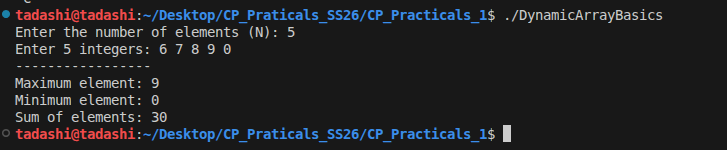
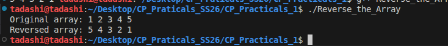
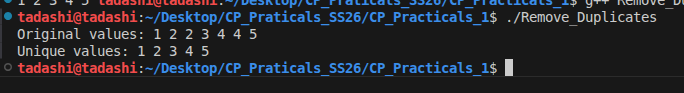
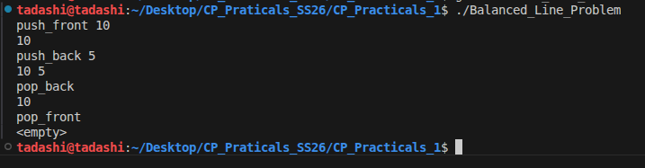
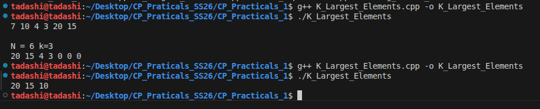
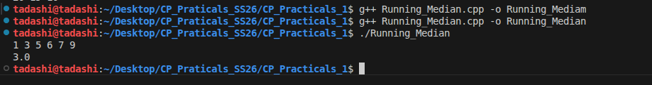
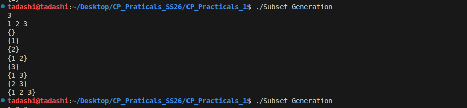
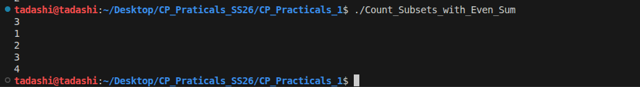
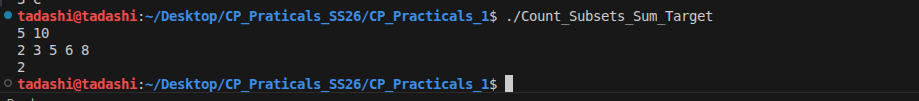

# Analysis of the solved problems

### Problem 1 — Dynamic Array Basics

The code uses vector (a dynamic container), <algorithm> for min/max functions, and <numeric> for calculating the sum of the given n integers.

```c++
vector<int> vec(n);
```
The `vector` allows memory to be allocated dynamically at runtime based on the input.

```c++
int max_val = *max_element(vec.begin(), vec.end());

```
This is the `STL algorithm` and it efficiently finds the largest element.

```c++
int min_val = *min_element(vec.begin(), vec.end());

```
This is also a `STL algorithm` and it efficiently finds the smallest element.

```c++
long long sum_val = accumulate(vec.begin(), vec.end(), 0LL);
```
It sums all elements in the range. Prevent integer overflow if the sum of integers exceeds the capacity of a standard int. 

#### Time complexity analysis : O(n)

The code have linear steps that allocates space for the n numbers of integers and read n values. To find the max_element it scans all the element once and another scan to find the min_element. To find the sum it scan all the element.


#### Space complexity analysis : O(n)

The dynamic storage is the vector size of n and other variables uses O(1) which is constand space. 


#### Reflection

While solving the problem I learned a few lessons :

1. Using the right data sturcture and algorithm 
2. The complexity of the program 
3. input and output checks


---

## Problem 2 — Reverse the Array

In an array of integers, it prints the element in their original order, then reverse the array and print the elements in reversed order. The goal is to demonstrate reversing a sequence in-place using C++ STL.

### Algorithm explanation

Initialize a vector<int> with the given elements.

Print the vector contents using a for loop (original order).

Call reverse(arr.begin(), arr.end()) to reverse the elements in-place.

Print the reverse order.

#### Time complexity analysis : O(n)

Printing the array once: O(n)

Reversing the array with reverse: O(n)

Printing again: O(n)

Total: O(n) (linear time)

#### Space complexity analysis : O(n)

Uses the original array in-place.

No additional arrays or large data structures are allocated.

Space complexity: O(1) extra space (ignoring the input vector itself).

#### Reflection

I solved it by first ensuring the array type was specified (vector<int>), then separating concerns printing the original, performing the reverse operation, and printing the result. This reinforces that reverse works in-place and that careful ordering lets before/after states without copying the array.


---

## Problem 3 — Remove Duplicates

In a given list of integers, the program prints the original values, then removes duplicates and prints the unique values. It uses C++ STL algorithms to sort the list and then eliminate repeated elements.

### Algorithm explanation

Print original array as-is (vector<int> arr).

Sort the array using sort(arr.begin(), arr.end()) so duplicates become adjacent.

Remove duplicates using:

1. unique(arr.begin(), arr.end()) which moves duplicates to the end and returns an iterator (last) to the new logical end.
2. arr.erase(last, arr.end()) to erase the redundant tail elements.
   
Print the resulting unique values after deduplication.

### Time Complexity Analysis : O(n log n)

Sorting: O(n log n) (dominant cost)

unique: O(n) (single pass)

erase: O(n) in the worst case (shifts/erases tail elements)

Overall: O(n log n)

### Space Complexity Analysis : O(1)

Uses the input vector in-place.

Sorting and unique operate in-place (aside from small constant extra overhead).

Space Complexity: O(1) additional space (excluding input storage)

### Reflection

I solved this by leveraging the standard C++ idiom of sorting then applying std::unique, which is a clean, efficient way to remove duplicates without manually tracking seen values. It reinforced that sorting first often simplifies duplicate-handling logic by bringing equal items together.



---

## Problem 4 — Sliding Window Maximum

In an given array and a window size k, the program computes the maximum value in every contiguous subarray of length k. It prints the original input array and then prints the sequence of sliding-window maxima.

## Algorithm Explanation

It use a deque to maintain indices of useful elements in decreasing order of values.

As we slide the window from left to right:

1. Remove indices that fall out of the current window (too old).
2. Remove indices whose values are smaller than the current element (they’ll never be maximum while current element is in window).
3. Push the current index into the deque.
4. Once we have a full window (i >= k-1), the front of the deque holds the maximum for that window.

## Time Complexity Analysis : O(n)

Each element is pushed and popped from the deque at most once.

The loop is linear in n.

## Space Complexity Analysis : O(k)

Uses an output vector sized ≈ n - k + 1.

Uses a deque that stores at most k indices

## Reflection

Using a deque to track candidate maxima is efficient because it avoids redundant comparisons and gives a true linear-time solution. The key insight is that once a larger element enters the window, smaller elements to its left become “useless” and can be discarded safely.


## Problem 5 — Balanced Line Problem

i was given a sequence of operations that add or remove people from either end of a line. After each operation (push_front, push_back, pop_front, pop_back), the program prints the current contents of the line.

## Algorithm explanation

Use a deque<int> to model the line because it supports efficient insertion/removal at both ends.
For each input command:

1. Parse the operation and optional value.
2. If it’s push_front x or push_back x, insert x at the appropriate end.
3. If it’s pop_front or pop_back, remove from the appropriate end if the deque isn’t empty.
4. Print the deque contents (or <empty> if it’s empty) after every operation.

## Time complexity analysis : O(1)

Each operation (push_front, push_back, pop_front, pop_back) runs in O(1)

## Space complexity analysis : O(n)

Uses O(n) space, where n is the maximum number of people currently in the line (deque size).

## Reflection

A deque is the natural choice for a “balanced line” because it directly supports both front and back operations efficiently. Handling input line-by-line and printing after each command makes it easy to verify the state at every step, which is great for debugging and understanding the effect of each operation.


---

### Problem 6 — K Largest Elements

Given N numbers, the program finds and prints the K largest values. It uses a max-heap (priority_queue) to efficiently retrieve the top K elements from the list.

## Algorithm explanation

Store all numbers in a max-heap (priority_queue), where the largest element is always at the top.

Extract the top element K times; each extraction gives the next largest number.

Print each extracted element in descending order (largest first).

## Time complexity analysis : O((N + K) log N)

Building the max-heap from N elements: O(N log N) (each insert is O(log N))

Extracting K elements: O(K log N)

## Space complexity analysis : O(N)

The max-heap stores all N elements: O(N)

Additional space is only a few fixed variables and output printing: O(1) extra beyond the heap.

## Reflection

A max-heap makes it easy to repeatedly extract the current largest element without sorting the entire list. This approach is straightforward and efficient for a “top-K” problem, and it reinforces that priority queues are the right tool when you need repeated access to extremes (min/max) in a dynamic set.


---

### Problem 7 — Running Median

In a given stream of numbers, output the median after each new number arrives. The median is the middle value (or average of two middle values) when the seen numbers are sorted.

##  Algorithm explanation

Use two heaps: a max-heap for the lower half and a min-heap for the upper half. Insert each new number into the appropriate heap, then rebalance so the heap sizes differ by at most 1. The median is either the top of the larger heap or the average of both tops when sizes are equal.

## Time complexity analysis

Each insertion and rebalance step involves at most a couple of heap operations (push/pop), each costing **O(log n)**. Since we do this for each of the n numbers, the overall time complexity is **O(n log n)**.

## Space complexity analysis

It store all seen numbers in the two heaps, so the space complexity is **O(n)**.

## Reflection on how you solved the problem or what you learnt

Maintaining two heaps is a clean way to keep track of the median in an online stream. The key insight is that by balancing the heaps, the median can be computed in constant time after each insertion, and the priority queue structure handles ordering automatically.


---

### Problem 8 — Subset Generation

In a given set of N numbers, generate and print all possible subsets (the power set). Each subset is represented using braces {} and elements are shown in the order they appear in the original set.

## Algorithm explanation

Use a bitmask technique where each number from 0 to 2^N - 1 represents one subset. For each bitmask:

Treat each bit position i as a flag: if bit i is 1, include arr[i] in the current subset.

Print the resulting subset enclosed in {}.

##  Time complexity analysis

There are 2^N possible subsets.

For each subset, we check up to N bits.

Total: O(N · 2^N)

## Space complexity analysis

Uses an array of size N for input.

No additional space grows with subset output (output is printed directly).

space: O(N)

## Reflection

The bitmask method is a clean and efficient way to generate all subsets without recursion. It directly maps the subset selection to binary representation, making it easy to enumerate all combinations and understand why there are 2^N of them.


---

### Problem 9 — Count Subsets with Even Sum

In the given N numbers, count how many subsets (including the empty subset) have an even sum. The solution generates all possible subsets and checks whether their sum is even.

## Algorithm explanation

Use bitmasking to represent each subset (from 0 to 2^N - 1). For each bitmask:

Sum the elements whose corresponding bit is 1.

If the sum is even, increment the count.

This systematically explores all subsets without recursion.

## Time complexity analysis

There are 2^N subsets.

For each subset, we potentially check up to N elements (to compute the sum).

Total time complexity: O(N · 2^N).

## Space complexity analysis

Uses O(N) space to store the input array.

Uses constant extra space for counters and loop variables.

Overall: O(N).

## Reflection

Bitmasking is a powerful way to iterate all subsets using simple integer operations. This problem reinforces how subset enumeration maps directly to binary representations and highlights why 2^N is the natural growth rate for these kinds of exhaustive searches.


---

### Problem 10 — Count of subsets with sum equal to target

In a given N numbers and a target sum X, count how many subsets of the numbers sum exactly to X. The solution uses dynamic programming to efficiently count valid subsets without enumerating them all.

## Algorithm explanation

Use a 1D DP array dp[s] where dp[s] is the number of subsets that sum to s.

Initialize dp[0] = 1 (the empty subset).

For each number x, update dp backwards from target down to x, adding dp[s - x] to dp[s].

This ensures each element is only used once per subset and avoids double counting.

## Time complexity analysis

The main loops iterate over N elements and for each element iterate over sums up to target.

Time complexity: O(N).

## Space complexity analysis

Uses a 1D DP array of size target + 1.

Space complexity: O(1).

## Reflection

This is a classic subset-sum counting problem where the key is to update the DP array backwards to prevent reuse of the same element in a single subset. It reinforces how dynamic programming reduces exponential subset enumeration to a polynomial-time solution.


