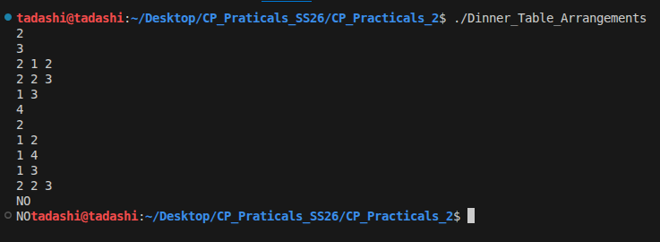
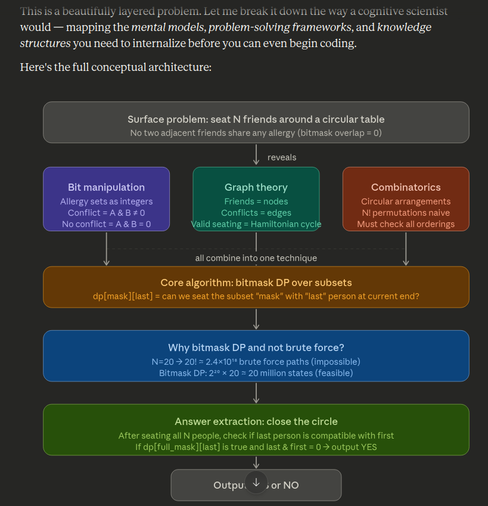
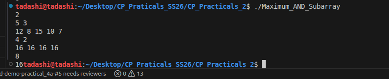
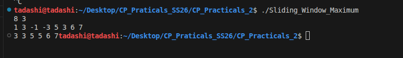
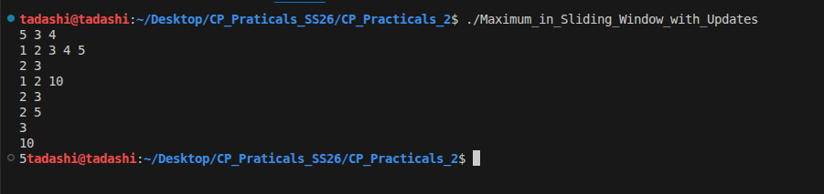
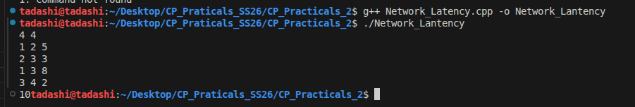
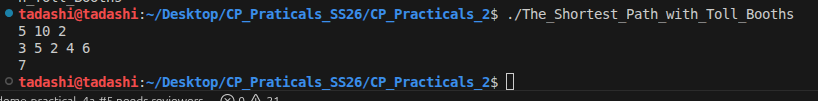

## Problem 1 : Dinner Table Arrangements

The Approach I used is bitmask DP for Hamiltonian cycle on compatibility graph

- Represent each friend's allergy set as a 30-bit mask.
- Build adjacency compatibility: can sit together if (mask[i] & mask[j]) == 0.
- Fix vertex 0 as start to avoid duplicate rotations in circular table.
- DP[subset][last] = true if we can visit `subset` of nodes (bitmask), ending at `last`.
- Initialize DP[1<<0][0] = true.
- Transition: from (subset,last) try adding `nxt` if not in subset and compatible with last.
- At full subset (all nodes visited), accept if there exists `last` != 0 with DP[full][last] and compatible(last,0).
- Special case N==1 is always YES (single person table is valid).

**time complexity** : O(N² * 2ᴺ) since the n = 20

**space complexity** : O(2ᴺ * N) for the DP table




Claude promt to understand the question better.

```cmd 
i have been struggling with the above question issue. analyze it like a cognitive scientist. Identify what concepts are use behind it.

```



--- 

## Problem 2 : Maximum AND Subarray

In the given array A of length N, is it to find the max possible value of (AND of exactly K-length subarray).

Approach I used : 

- Use bit-greedy constructing answer from MSB down to LSB.
- At each bit position b, test candidate = ans | (1<<b).
- Check if there exists a contiguous subarray of length K whose all values have all bits of candidate.
- Equivalent: for each element x in window, (x & candidate) == candidate.
- If yes, keep this bit in ans (ans=candidate); else skip it.
  
This gives maximum achievable AND over all windows of size K.

**Time complexity** : O(T*N)

**Space complexity** : O(N) (input array)



Claude promt to understand the question better.

```cmd 
i have been struggling with the above question issue. analyze it like a cognitive scientist. Identify what concepts are use behind it.

```


---

## Problem 3 : Sliding Window Maximum

In the given array A of N integers and window size K, output max in each window A[i..i+K-1] for i=0..N-K.

Approach i did the following: 

- Use deque to maintain indices of potential max elements in current window.
- Maintain deque `dq` such that A[dq[0]] is max in current window.
- Pop front when out of window (index <= i-K).
- Pop back while A[new] >= A[dq.back()] to keeO((N + Q) log N)p decreasing values.
- Push current index.
- Starting from i>=K-1, output A[dq.front()].
  
**Time complexity** : O(N)

**Spacecomplexity** : O(K)



Claude promt to understand the question better.

```cmd 
i have been struggling with the above question issue. analyze it like a cognitive scientist. Identify what concepts are use behind it.

```


---

## Problem 4 : Maximum in Sliding Window with Updates

In the given array

- N elements array, window size K.
- Q queries:
- Type 1: 1 pos val
- Type 2: 2 i 
- Build a segment tree for max queries and point updates.
- For Type 2: compute L = i-K+1 (1-based), clamp to >=1. If L > i, no window -> undefined.
- Return max over [L..i].

**Time complexity** : O(NlogN)

**Space complexity** : O(N)




Claude promt to understand the question better.

```cmd 
i have been struggling with the above question issue. analyze it like a cognitive scientist. Identify what concepts are use behind it.

```


---

## Problem 5 : Network Latency

- Read N, M.
- Build adjacency list adj for an undirected weighted graph:
- adj[u].push_back({v,w}), and vice versa.
- Dijkstra initialization:
- dist[] all inf, dist[1] = 0.
- min-heap pq of (distance, node).
- Pop nearest unprocessed node (d,u) from queue:
- skip if d > dist[u] (stale entry).
- relax neighbors:
- if dist[v] > dist[u] + w, update and push into heap.
- After completion, dist[N] is answer:
- if INF → print -1
- else print dist[N].

**Time complexity** : O(NlogN)

**Space complexity** : O(N)




Github copilot promt to understand the question better.

```cmd 
i have been struggling with the above question issue. analyze it like a cognitive scientist. Identify what concepts are use behind it.

```


## Problem 6: The Shortest Path with Toll Booths


It reads input:

- N booths
- M coins
- K max skips
- toll[0..N-1]
- Computes total = sum(toll).

- Sorts tolls descending (highest toll first):

- sort(toll.begin(), toll.end(), greater<ll>());
- This assumes skipping is best used on the largest tolls.
- Iterates s = 0..min(K,N):

- skip_sum = sum of top s tolls (largest paid amounts removed).
- paid = total - skip_sum.
- If paid <= M, we can afford using s skips, choose that s.
- Track first feasible s as best_s.
- If impossible (best_s == -1): print -1.

- Otherwise compute “minimum time”:

- min_time = N + best_s.
(Meaning: each step costs 1 minute if paying, +1 extra if skipping; total N steps then plus best_s skip overhead)

**Time complexity** : O(NlogN)

**Space complexity** : O(n)

